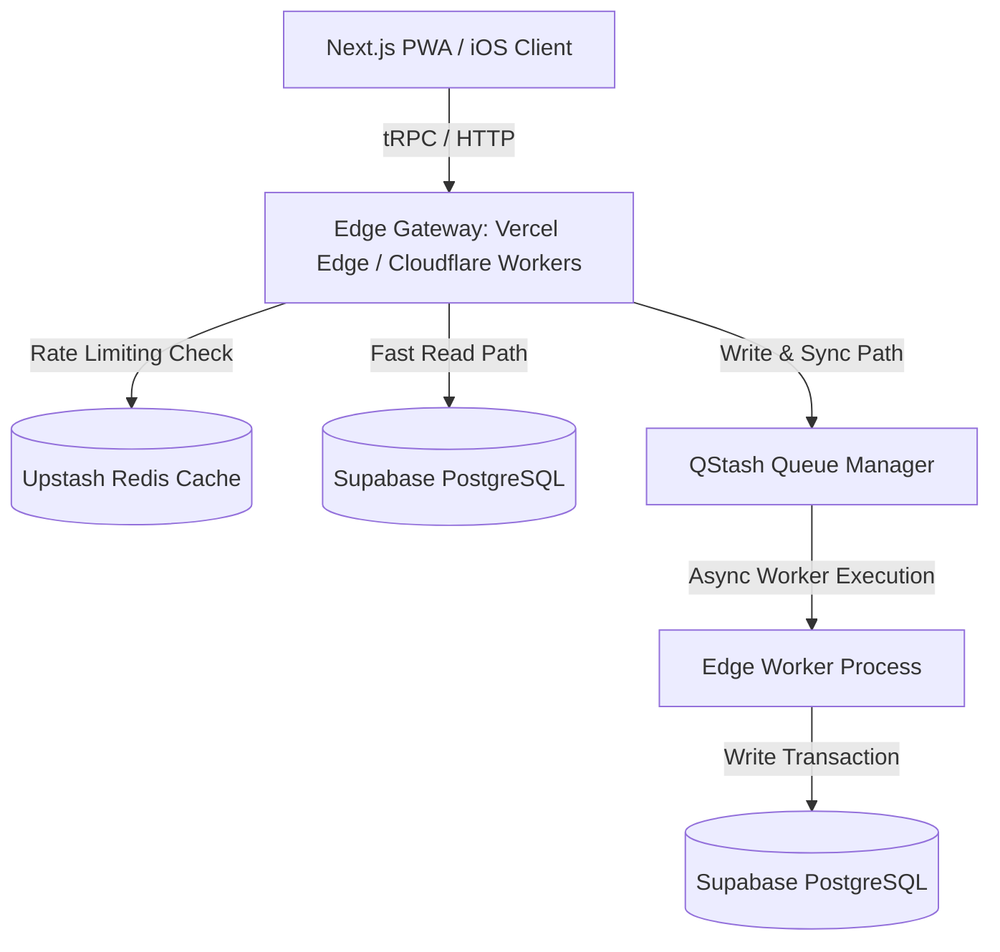
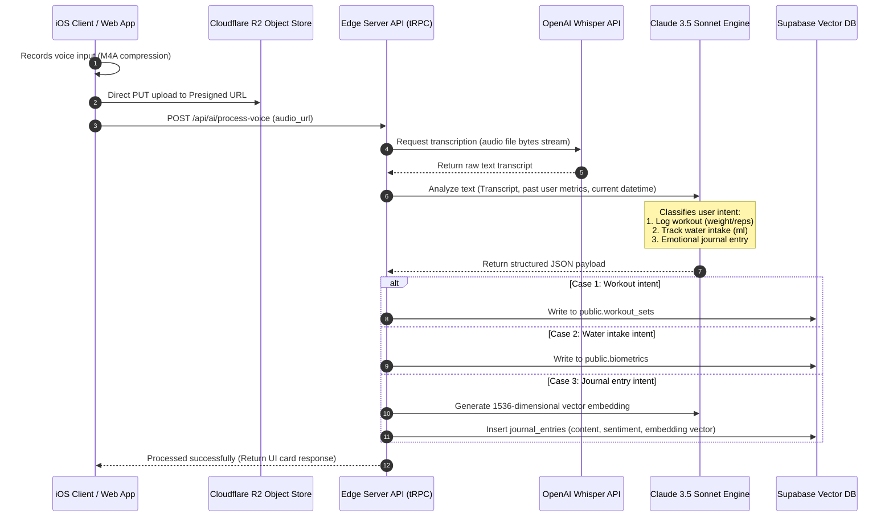

# Aura: System Architecture & Tech Stack

This document outlines the complete technology stack, architectural designs, backend workflows, and AI engines driving the Aura Personal Growth OS.

---

## 🛠️ Monorepo Technology Stack

Every component in the Aura stack has been selected to guarantee a premium user experience, rapid development speed, scalable database patterns, and generous developer free tiers.

### 1. Authentication: Clerk
- **Selection**: Clerk Auth Engine.
- **Why**: Handling secure authentication across Web, PWA, and Mobile Native is notoriously error-prone. Clerk provides unified session tokens, OAuth providers (Google, Apple) out-of-the-box, secure local-storage/keychain JWT verification, passkeys, and direct metadata synchronization via secure webhooks.
- **Free Tier**: Up to 10,000 Monthly Active Users (MAUs), fully loaded with passkeys and multi-factor authentication.

### 2. Database: Supabase (PostgreSQL)
- **Selection**: Supabase DB.
- **Why**: PostgreSQL is the gold standard for relational consistency. Supabase provides a fully managed instance with standard tools like `pgvector` for storing embedding coordinates (needed for journal semantic searches) and Realtime WebSocket extensions for social habit features.
- **Free Tier**: 2 free projects, each up to 500MB of database storage, which easily scales to support initial thousands of active users.

### 3. ORM: Drizzle ORM
- **Selection**: Drizzle ORM.
- **Why**: Unlike traditional heavy ORMs (like Prisma), Drizzle acts as a lightweight query builder that is 100% compatible with edge runtimes (Cloudflare Workers, Vercel Edge). It yields sub-millisecond query construction overhead and offers type safety directly from the schema declaration.
- **Free Tier**: Free, open-source (MIT).

### 4. Validation: Zod
- **Selection**: Zod Schema Validator.
- **Why**: Eliminates "schema drift." A single Zod object validation schema is declared in `packages/api` and is used to validate inputs on the web client form, the React Native voice inputs, and the backend Edge functions.
- **Free Tier**: Free, open-source (MIT).

### 5. State Management: Zustand + TanStack Query
- **Selection**: Zustand (Client UI State) & TanStack Query (Server State Cache).
- **Why**: Zustand is a minimal, fast, and hook-based state store. It handles temporary client layouts, active workout timers, and media player states. TanStack Query manages data fetching, caching, automatic retry states, and optimistic offline UI updates.
- **Free Tier**: Free, open-source (MIT).

### 6. Animations: Framer Motion (Web) & React Native Reanimated (Mobile)
- **Selection**: Framer Motion (Next.js) & Reanimated 3 (Expo).
- **Why**: Reanimated runs animation drivers directly on the native UI thread, bypassing the React Native JS bridge and maintaining a consistent 120 FPS frame rate on modern iOS screens. Framer Motion offers custom cubic-bezier declarations and shared element layout transitions on Web.
- **Free Tier**: Free, open-source (MIT).

### 7. Charts: Tremor (Web) & Victory Native (Mobile)
- **Selection**: Tremor (Next.js components) & Victory Native (Expo wrapper).
- **Why**: Aura is data-rich (workouts, biometrics, water intake). Tremor provides dark-mode-first, premium UI component charts. Victory Native relies on React Native SVG for lightweight native charting.
- **Free Tier**: Free, open-source (MIT).

### 8. Notifications: Novu
- **Selection**: Novu Unified Notification Platform.
- **Why**: Instead of writing separate channels for iOS APNS (Apple Push Notification Service), web push, and transactional SMS/Email, Novu provides a single API endpoint to route smart notifications.
- **Free Tier**: 30,000 notifications per month.

### 9. Email: Resend + React Email
- **Selection**: Resend.
- **Why**: Resend is built for developer experience, enabling developers to code high-quality, responsive email templates in React instead of legacy HTML tables.
- **Free Tier**: 3,000 emails per month (100 emails/day).

### 10. Storage: Cloudflare R2
- **Selection**: Cloudflare R2 (S3-Compatible Object Store).
- **Why**: Unlike AWS S3, Cloudflare R2 does not charge any egress bandwidth fees. This is critical for storing high-resolution audio files (voice journals) and workout images/videos uploaded by users.
- **Free Tier**: 10 GB of storage per month, 1M Class A operations, 10M Class B operations.

### 11. AI Engine: Vercel AI SDK (with OpenAI & Anthropic Claude APIs)
- **Selection**: Vercel AI SDK Core.
- **Why**: Vercel AI SDK provides unified APIs for streaming LLM text completions (`streamText`), tool execution (`useChat`), and structured JSON output generation (`generateObject`). We use Claude 3.5 Sonnet for journal analysis and GPT-4o-mini for fast intent detection.
- **Free Tier**: SDK is open-source. API usage is pay-per-use (approx. $0.15/million tokens for mini models).

### 12. Speech-to-Text: OpenAI Whisper API
- **Selection**: OpenAI Whisper Large-v3.
- **Why**: Provides state-of-the-art multilingual transcription of voice recordings, coping with accents, ambient noise, and workout heavy breathing.
- **Free Tier**: Pay-per-use ($0.006 per minute of transcribed audio).

### 13. Hosting: Vercel (Web & API) & Expo Application Services (EAS)
- **Selection**: Vercel Serverless Hosting + EAS build.
- **Why**: Vercel offers seamless deployment of Next.js apps with edge function integration. EAS automates the compilation of custom native iOS clients and handles App Store submissions.
- **Free Tier**: Vercel Hobby tier + EAS Free tier (30 native builds/mo).

### 14. Analytics: PostHog
- **Selection**: PostHog Product Suite.
- **Why**: Combines product analytics, cohort analysis, session replays, custom event pipelines, and remote A/B testing flags inside a single client SDK.
- **Free Tier**: 1 million free events and 15,000 session recordings per month.

### 15. Monitoring: Sentry
- **Selection**: Sentry Application Monitoring.
- **Why**: Real-time error stack traces on native iOS (including objective-c/swift symbols mapping) and edge functions.
- **Free Tier**: 5,000 events per month.

### 16. Testing: Vitest & Playwright
- **Selection**: Vitest (Unit testing) & Playwright (E2E testing).
- **Why**: Vitest runs tests parallelized inside Vite/Next runtimes with native ESM support. Playwright simulates user-journey tests (e.g., login, onboarding, habits) inside headless Chromium, WebKit, and Firefox.
- **Free Tier**: Free, open-source.

---

## 🌐 Edge-First Backend Architecture

Aura's backend operates on a globally distributed, edge-native micro-runtime using Vercel Edge functions and Cloudflare Workers. This minimizes Cold Starts and keeps request latencies under 50ms globally.



### 1. API Strategy: Next.js Server Actions & tRPC Router
- **Web App**: Uses Next.js Server Actions directly in forms and interactive micro-interactions for secure, server-side data mutations without boilerplate API endpoints.
- **Mobile Native & Shared API Client**: Expo iOS client connects to a unified tRPC router exposed at `/api/trpc` under the same monorepo configuration. This ensures that a database column modification immediately triggers TS compile-time errors in the mobile client.

### 2. Edge-Native Rate Limiting
- To protect AI inference API endpoints (Whisper transcriptions, journal generation) from DDoS attacks, we use an edge-optimized rate limiter built on **Upstash Redis** (via `@upstash/ratelimit`).
- Implements a **Sliding Window Counter** algorithm.
- Endpoint limits:
  - Voice Transcriptions: 5 requests / minute per user.
  - Core API endpoints: 100 requests / minute per user.
  - Guest Mode endpoints: 30 requests / minute per IP address.

### 3. Caching: Stale-While-Revalidate (SWR) & Local Sync
- Dynamic user profile details, active habit streak counts, and historic graphs are cached on Edge Nodes utilizing CDN headers: `s-maxage=60, stale-while-revalidate=604800`.
- The native app caches data in **Expo SQLite** via TanStack Query client synchronization. This permits immediate offline renders. When a connection is re-established, TanStack Query runs background sync reconciliations.

### 4. Serverless Queue & Background Workers
- Heavy asynchronous workloads (e.g., processing LLM sentiment analyses, syncing biometric histories with Apple Health, sending marketing sequences) are offloaded to **Upstash QStash**.
- QStash guarantees at-least-once delivery by issuing secure HTTP callbacks to Edge API routes (`/api/workers/*`) with automated exponential backoff retries.

### 5. Scheduled Cron Jobs
- Daily calculations are run utilizing scheduled workers triggered by Vercel Cron Schedules:
  - **Habit Streak Engine (00:01 local timezone)**: Scans active habits, checks if completions fell short of parameters, and decays streaks or records freezes.
  - **Weekly Growth Reports (Sundays at 20:00)**: Collects logs, calculates biometrics summaries, and feeds context into Claude to generate structured weekly recommendation cards.

### 6. Webhooks Synchronization
- **Clerk Webhooks**: Captures `user.created`, `user.updated`, and `user.deleted` events. Handled via a secure endpoint verified using Cryptographic Webhook Signatures (via `@octokit/webhooks-methods` / `svix`).
- **Stripe Webhooks**: Tracks premium subscription updates to instantly enable advanced AI coaching features.

---

## 🧠 AI & Speech-to-Text Architecture (AI-First Core)

Aura integrates speech recognition, semantic search databases, intent categorization, and automated coaching recommendations into a unified growth pipeline.



### 1. Intent Detection & Structured JSON Schema
The core user-experience engine relies on prompt schema locking (Vercel AI SDK `generateObject`). When a user types or speaks, the message is analyzed against the following Zod intent schema:

```typescript
const IntentSchema = z.object({
  intentType: z.enum(["workout", "water", "sleep", "journal", "general_command"]),
  confidence: z.number().min(0).max(1),
  extractedData: z.object({
    exerciseName: z.string().optional(),
    sets: z.array(z.object({
      reps: z.number(),
      weightKg: z.number(),
      rpe: z.number().optional()
    })).optional(),
    waterMl: z.number().optional(),
    sleepHours: z.number().optional(),
    journalContent: z.string().optional(),
    sentimentAnalysis: z.object({
      moodScore1to10: z.number(),
      dominantEmotion: z.string(),
      anxietyLevel: z.enum(["low", "medium", "high"])
    }).optional()
  })
});
```

### 2. Semantic Search & Vector Embeddings
- Every written or spoken journal entry is vectorized using OpenAI's `text-embedding-3-small` model, producing a 1536-dimensional float vector.
- Vector coordinates are saved in the `embedding` column on the `journal_entries` table.
- A user asking *"When was the last time I felt exhausted during a leg workout?"* triggers an edge semantic query:
  ```sql
  SELECT content, created_at, mood_score, sentiment
  FROM public.journal_entries
  WHERE user_id = :current_user
  ORDER BY embedding <=> :query_embedding -- Cosine distance
  LIMIT 3;
  ```
- These historical matching records are fed into the LLM context, allowing the AI Coach to answer with specific, data-backed insights.
