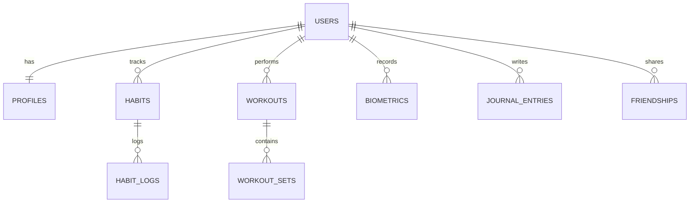

# Aura: PostgreSQL Database Schema & Relational Specifications

This document outlines the database schema, relational constraints, performance indexing strategies, and Row-Level Security (RLS) policies for Aura. Aura uses PostgreSQL as its database engine, utilizing Supabase as the provider and Drizzle ORM as the application interface.

---

## 📊 Entity Relationship Diagram



---

## 🗄️ Database Tables Specification

### 1. User & Profile Management
Handles identity syncing from Clerk. Authentication is delegated to Clerk, which fires webhooks to synchronize user profiles in PostgreSQL.

```sql
-- Profiles table linked to Clerk user_id
CREATE TABLE public.profiles (
    id UUID PRIMARY KEY DEFAULT gen_random_uuid(),
    clerk_id VARCHAR(255) NOT NULL UNIQUE,
    username VARCHAR(50) NOT NULL UNIQUE,
    display_name VARCHAR(100),
    avatar_url TEXT,
    timezone VARCHAR(50) DEFAULT 'UTC',
    created_at TIMESTAMP WITH TIME ZONE DEFAULT timezone('utc'::text, now()) NOT NULL,
    updated_at TIMESTAMP WITH TIME ZONE DEFAULT timezone('utc'::text, now()) NOT NULL,
    
    CONSTRAINT username_min_length CHECK (char_length(username) >= 3)
);

CREATE INDEX idx_profiles_clerk_id ON public.profiles(clerk_id);
CREATE INDEX idx_profiles_username ON public.profiles(username);
```

### 2. Habits & Streaks (Duolingo-Inspired)
Tracks recurring personal habits, Streaks, freeze days, and completions.

```sql
CREATE TABLE public.habits (
    id UUID PRIMARY KEY DEFAULT gen_random_uuid(),
    user_id UUID NOT NULL REFERENCES public.profiles(id) ON DELETE CASCADE,
    name VARCHAR(255) NOT NULL,
    description TEXT,
    frequency_cron VARCHAR(50) DEFAULT '0 0 * * *' NOT NULL, -- Cron syntax for custom scheduling
    target_count INTEGER DEFAULT 1 NOT NULL,
    streak_count INTEGER DEFAULT 0 NOT NULL,
    max_streak INTEGER DEFAULT 0 NOT NULL,
    last_completed_at TIMESTAMP WITH TIME ZONE,
    created_at TIMESTAMP WITH TIME ZONE DEFAULT timezone('utc'::text, now()) NOT NULL,
    
    CONSTRAINT target_positive CHECK (target_count > 0)
);

CREATE TABLE public.habit_logs (
    id UUID PRIMARY KEY DEFAULT gen_random_uuid(),
    habit_id UUID NOT NULL REFERENCES public.habits(id) ON DELETE CASCADE,
    completed_at TIMESTAMP WITH TIME ZONE DEFAULT timezone('utc'::text, now()) NOT NULL,
    count_logged INTEGER DEFAULT 1 NOT NULL,
    
    CONSTRAINT count_positive CHECK (count_logged > 0)
);

CREATE INDEX idx_habits_user ON public.habits(user_id);
CREATE INDEX idx_habit_logs_habit ON public.habit_logs(habit_id);
CREATE UNIQUE INDEX idx_habit_logs_day ON public.habit_logs(habit_id, (completed_at::date));
```

### 3. Workouts & Exercise Logger (Strong-Inspired)
Tracks muscle groups, resistance exercises, set types (warmup, working, drop), reps, weights, and Rate of Perceived Exertion (RPE).

```sql
CREATE TABLE public.exercises (
    id UUID PRIMARY KEY DEFAULT gen_random_uuid(),
    name VARCHAR(255) NOT NULL UNIQUE,
    muscle_group VARCHAR(100) NOT NULL,
    description TEXT,
    is_custom BOOLEAN DEFAULT false NOT NULL,
    created_by UUID REFERENCES public.profiles(id) ON DELETE SET NULL
);

CREATE TABLE public.workouts (
    id UUID PRIMARY KEY DEFAULT gen_random_uuid(),
    user_id UUID NOT NULL REFERENCES public.profiles(id) ON DELETE CASCADE,
    name VARCHAR(255) DEFAULT 'Workout Session' NOT NULL,
    started_at TIMESTAMP WITH TIME ZONE DEFAULT timezone('utc'::text, now()) NOT NULL,
    completed_at TIMESTAMP WITH TIME ZONE,
    notes TEXT,
    created_at TIMESTAMP WITH TIME ZONE DEFAULT timezone('utc'::text, now()) NOT NULL
);

CREATE TABLE public.workout_sets (
    id UUID PRIMARY KEY DEFAULT gen_random_uuid(),
    workout_id UUID NOT NULL REFERENCES public.workouts(id) ON DELETE CASCADE,
    exercise_id UUID NOT NULL REFERENCES public.exercises(id) ON DELETE RESTRICT,
    set_number INTEGER NOT NULL,
    weight NUMERIC(6, 2) NOT NULL,
    reps INTEGER NOT NULL,
    rpe INTEGER CHECK (rpe >= 1 AND rpe <= 10),
    set_type VARCHAR(20) DEFAULT 'working' NOT NULL, -- 'warmup', 'working', 'dropset', 'failure'
    
    CONSTRAINT set_num_positive CHECK (set_number > 0),
    CONSTRAINT reps_positive CHECK (reps >= 0)
);

CREATE INDEX idx_workouts_user ON public.workouts(user_id);
CREATE INDEX idx_workout_sets_workout ON public.workout_sets(workout_id);
CREATE INDEX idx_workout_sets_exercise ON public.workout_sets(exercise_id);
```

### 4. Apple Health-Style Biometrics & Inputs
For hydration tracking, sleep analytics, steps, and active heart rate recordings.

```sql
CREATE TABLE public.biometrics (
    id UUID PRIMARY KEY DEFAULT gen_random_uuid(),
    user_id UUID NOT NULL REFERENCES public.profiles(id) ON DELETE CASCADE,
    metric_type VARCHAR(50) NOT NULL, -- 'steps', 'water_ml', 'sleep_seconds', 'heart_rate'
    value NUMERIC(10, 2) NOT NULL,
    recorded_at TIMESTAMP WITH TIME ZONE DEFAULT timezone('utc'::text, now()) NOT NULL,
    source VARCHAR(100) DEFAULT 'manual' NOT NULL -- 'manual', 'apple_health', 'google_fit'
);

CREATE INDEX idx_biometrics_user_type_date ON public.biometrics(user_id, metric_type, recorded_at DESC);
```

### 5. AI-First Journal & Vector Embeddings
Stores text entries, sentiment classification, emotional scores, and 1536-dimensional embeddings for semantic search retrieval.

```sql
-- Enable the pgvector extension for AI similarity search
CREATE EXTENSION IF NOT EXISTS vector;

CREATE TABLE public.journal_entries (
    id UUID PRIMARY KEY DEFAULT gen_random_uuid(),
    user_id UUID NOT NULL REFERENCES public.profiles(id) ON DELETE CASCADE,
    content TEXT NOT NULL,
    voice_url TEXT, -- If created via Whisper voice transcript
    mood_score INTEGER CHECK (mood_score >= 1 AND mood_score <= 10),
    sentiment VARCHAR(50), -- 'positive', 'neutral', 'negative', 'anxious', etc.
    embedding VECTOR(1536), -- Vector coordinate for semantic search
    created_at TIMESTAMP WITH TIME ZONE DEFAULT timezone('utc'::text, now()) NOT NULL,
    updated_at TIMESTAMP WITH TIME ZONE DEFAULT timezone('utc'::text, now()) NOT NULL
);

CREATE INDEX idx_journal_user ON public.journal_entries(user_id);
-- HNSW index for fast semantic search using cosine distance
CREATE INDEX idx_journal_embeddings ON public.journal_entries USING hnsw (embedding vector_cosine_ops);
```

### 6. Social Connections & Streaks (Discord-Inspired)
Tracks mutual friendships, blocklists, and shared growth challenges.

```sql
CREATE TABLE public.friendships (
    id UUID PRIMARY KEY DEFAULT gen_random_uuid(),
    user_id UUID NOT NULL REFERENCES public.profiles(id) ON DELETE CASCADE,
    friend_id UUID NOT NULL REFERENCES public.profiles(id) ON DELETE CASCADE,
    status VARCHAR(50) DEFAULT 'pending' NOT NULL, -- 'pending', 'accepted', 'blocked'
    created_at TIMESTAMP WITH TIME ZONE DEFAULT timezone('utc'::text, now()) NOT NULL,
    
    CONSTRAINT no_self_friend CHECK (user_id <> friend_id),
    UNIQUE (user_id, friend_id)
);

CREATE INDEX idx_friendships_users ON public.friendships(user_id, friend_id);
```

---

## 🔒 Row-Level Security (RLS) Policies

To enforce strict user privacy (necessary for health and journal entries), PostgreSQL Row-Level Security is enabled globally.

```sql
-- Enable RLS on core tables
ALTER TABLE public.profiles ENABLE ROW LEVEL SECURITY;
ALTER TABLE public.habits ENABLE ROW LEVEL SECURITY;
ALTER TABLE public.workouts ENABLE ROW LEVEL SECURITY;
ALTER TABLE public.biometrics ENABLE ROW LEVEL SECURITY;
ALTER TABLE public.journal_entries ENABLE ROW LEVEL SECURITY;
ALTER TABLE public.friendships ENABLE ROW LEVEL SECURITY;

-- 1. Profiles policy (Public lookup for usernames, update only by owner)
CREATE POLICY "Public profiles are viewable by everyone" ON public.profiles
    FOR SELECT USING (true);
CREATE POLICY "Users can update their own profile" ON public.profiles
    FOR UPDATE USING (auth.uid() = id);

-- 2. General Owner-Only Read/Write Policy Template
-- Applicable to Habits, Workouts, Biometrics, and Journal Entries
CREATE POLICY "Owners can access their own habits" ON public.habits
    FOR ALL USING (auth.uid() = user_id);

CREATE POLICY "Owners can access their own workouts" ON public.workouts
    FOR ALL USING (auth.uid() = user_id);

CREATE POLICY "Owners can access their own biometrics" ON public.biometrics
    FOR ALL USING (auth.uid() = user_id);

CREATE POLICY "Owners can access their own journals" ON public.journal_entries
    FOR ALL USING (auth.uid() = user_id);
```
