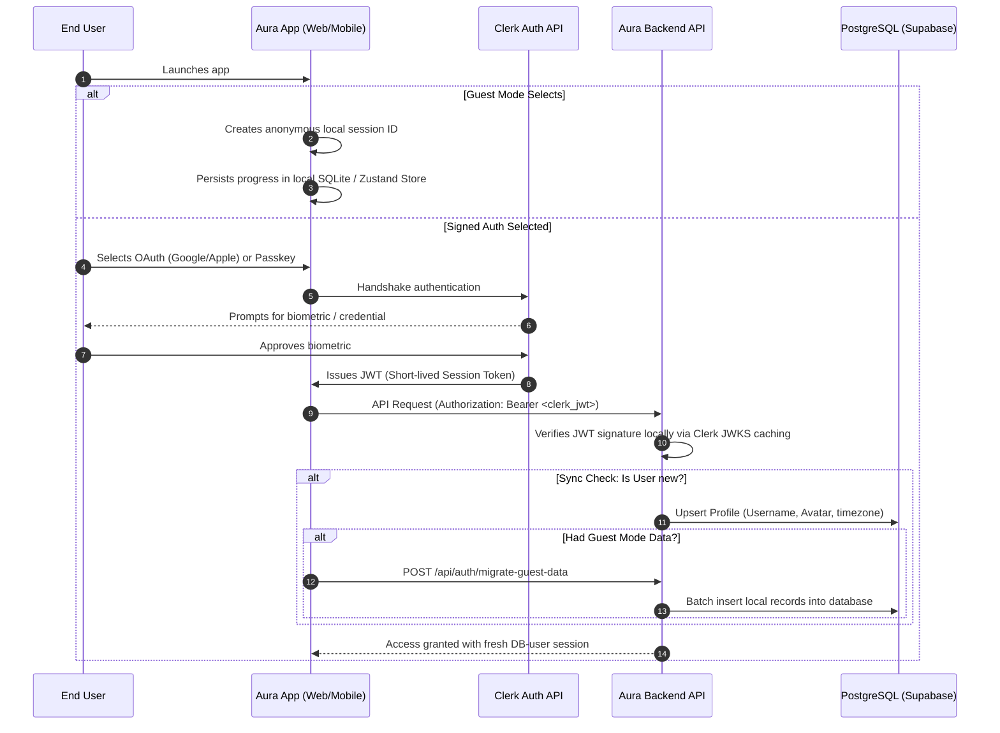

# Aura: Product Specifications & Information Architecture

This document outlines the authentication mechanics, user state lifecycle, and screen-by-screen Information Architecture (IA) for the Aura Personal Growth OS.

---

## 🔐 Authentication System Design (Clerk-Driven)

Aura uses **Clerk** to manage identity lifecycle, authentication states, multi-factor setups, and social login providers. This ensures high compliance with security standards while providing a smooth login experience.

### 1. Supported Authentication Methods
- **Social OAuth**: Apple Sign-In (required for App Store approval) and Google Sign-In (one-tap flows).
- **Passwordless**: Email Magic Links for rapid web conversions.
- **Passkeys (FIDO2)**: Biometric authentication (Touch ID / Face ID) for secure passwordless device logins.
- **Guest Mode**: Interactive onboarding path allowing users to experience the application immediately.

---

## 🔄 The Authentication Lifecycle Flow



---

## 👥 User Profile & State Specifications

### 1. Username Availability Check
To provide a smooth, Raycast-like username claim experience:
- Debounced text entry on profile creation triggers `GET /api/profiles/check-username?q=username`.
- A fast index lookup runs: `SELECT EXISTS (SELECT 1 FROM public.profiles WHERE username = $1)`.
- Returns `{ available: boolean }` within 30ms to toggle inline UI indicators.

### 2. Avatar Upload Pipeline
To avoid loading third-party scripts or proxying heavy binary images through edge functions, Aura uses direct-to-storage uploads via Cloudflare R2:
1. Client requests a secure, timed URL: `POST /api/profiles/avatar-upload-url` (authenticated via Clerk JWT).
2. Backend generates a Cloudflare R2 PutObject presigned URL containing constraints (e.g., maximum 5MB, `Content-Type: image/*`).
3. Client directly uploads the raw file to the presigned URL using standard `PUT` requests.
4. Client receives status 200, then commits the URL path to the database profile table: `PATCH /api/profiles/avatar`.

### 3. Guest Mode Data Migration
- While in Guest Mode, all metrics (water logs, completed habit checks, workouts) are written to local stores:
  - **Mobile**: Expo SQLite.
  - **Web**: Persisted Zustand store inside browser `localStorage`.
- Upon sign-up/link-account, the app triggers a payload migration:
  ```json
  {
    "guest_session_id": "usr_guest_12345",
    "payload": {
      "habits": [...],
      "workouts": [...],
      "biometrics": [...]
    }
  }
  ```
- The backend processes this inside a database transaction, converting guest record references into the newly synced user profile ID, preserving streaks and logs.

---

## 🛡️ Security Best Practices

### 1. JWT & Session Management
- **Short-Lived JWTs**: Clerk access tokens expire after 60 seconds, minimizing the window of opportunity for stolen token attacks.
- **Session Refresh**: Handled automatically in the background by the Clerk SDK via HTTP-only refresh cookies (Web) or secure hardware storage refresh keys (Native Mobile).
- **JWT Verification**: Backend Edge API endpoints parse the JWT header, retrieve the public keys dynamically from Clerk's JWKS endpoint, and verify signatures cryptographically using standard HS256/RS256 algorithms. No slow database calls are made for verification.

### 2. Roles & Permissions (RBAC)
Aura maps permissions within the JWT metadata payload:
- **`role: 'guest'`**: Read-only local storage mock data.
- **`role: 'user'`**: Full access to personal habits, workouts, AI journals, and biometrics.
- **`role: 'premium_user'`**: Unlocks advanced AI coach reports, historical analysis, and custom integrations.
- **`role: 'admin'`**: Access to analytics dashboards and global system metrics.

Database queries restrict records utilizing Row-Level Security policies to prevent ID-harvesting or data leakage.

---

## 📱 Information Architecture: Screen-by-Screen Layouts

The following section defines the layout structure, typography hierarchy, primary action triggers, and transition states for the Aura system.

### 1. Landing & Conversion Page (`/`)
- **Visual Hierarchy**: Large geometric heading, glowing glassmorphic background, interactive product interface mockups, live habit/workout counter widget.
- **Headers & Labels**:
  - H1: "Why Stay Mediocre?" (Font: Outfit, ExtraBold, Tracking tight).
  - Subhead: "Aura is your personal growth OS. Habit tracking, workout logger, biometric sync, and AI coaching. All offline-first."
- **Interactive Inputs**:
  - Email entry field + "Get Started" call-to-action button (slides to Sign-Up on click).
  - Floating mock interactive habit circle (completes on tap, triggering a subtle haptic pop).
- **Navigation**: Sticky minimal top navbar with logo, pricing links, and a glowing "Sign In" button.

### 2. Authentication Screen (`/sign-in` & `/sign-up`)
- **Visual Hierarchy**: Centered clean card overlay against a dark ambient violet background.
- **Headers & Labels**:
  - Title: "Welcome back to Aura" / "Claim your username".
- **Interactive Inputs**:
  - Apple OAuth button (Black with logo, rounded-xl).
  - Google OAuth button (White with logo, rounded-xl).
  - Email field for passwordless Magic Link + "Send Link" button.
  - Link to "Enter as Guest" (Bottom link, muted gray).
- **Transitions**: Slide in from the bottom with a 300ms spring transition.

### 3. Personalization & Onboarding Flow (`/onboarding`)
- **Visual Hierarchy**: Multi-step progress bar (top), large questionnaire cards, custom slider controls.
- **Headers & Labels**:
  - Step 1 H2: "Select your main focus areas."
  - Step 2 H2: "When do you feel most productive?"
- **Interactive Inputs**:
  - Step 1: Tap-selectable grid cells (Fitness, Mindfulness, Productivity, Deep Sleep) with checkmark reveals.
  - Step 2: Haptic-enabled timezone/circadian slider (Night Owl vs. Early Bird).
  - Step 3: Username creation field (with debounced availability indicators).
- **Transitions**: Horizontal slide-out/slide-in direction-aware transitions.

### 4. Main OS Dashboard (`/dashboard`)
- **Visual Hierarchy**: Daily Progress Ring (top center), grid layout of interactive metrics cards (Workouts, Water, Sleep, Habits).
- **Headers & Labels**:
  - H1: "Good Morning, [Name]" (Outfit, Bold, displaying the current date).
  - Aura Score: "86 / 100" (SF Pro Mono, tabular-nums).
- **Interactive Inputs**:
  - Floating Action Button (FAB): "+" opens a quick actions modal (voice input, water logger, workout starter).
  - Swipe right on habit items to check them off instantly.
- **Navigation**: Persistent bottom tab bar (Home, Workouts, Analytics, Social, Settings).

### 5. Workout Tracker (`/workouts`)
- **Visual Hierarchy**: List of past workouts, search bar for exercises, "Start Empty Workout" call-to-action.
- **Headers & Labels**:
  - H2: "Your Routines".
  - Metric indicators: Total sessions, volume, personal records.
- **Interactive Inputs**:
  - "Quick Start" button.
  - Muscle group filter tags (Chest, Back, Legs).
  - Long-press routines to edit sets/reps templates.
- **Transitions**: Card-to-screen shared element layout animation.

### 6. Active Workout Set Logger (`/workouts/active`)
- **Visual Hierarchy**: Workout timer (header), exercise cards displaying a grid of sets (weight, reps, RPE checkmarks).
- **Headers & Labels**:
  - Active Timer: "00:42:15" (SF Pro Mono, tabular-nums).
  - Exercise title, past set logs for reference.
- **Interactive Inputs**:
  - Weight numeric input, reps numeric input.
  - "Log Set" button (press changes background to green checkmark, triggering light haptics).
  - "Finish Workout" button (requires hold-to-confirm pattern).
  - Rest Timer popup showing countdown progress.

### 7. Hydration (Water) Tracker (`/biometrics/water`)
- **Visual Hierarchy**: Large animated wave container filling up based on daily progress percentage.
- **Headers & Labels**:
  - Daily Goal: "1,250ml / 3,000ml" (SF Pro Mono, bold).
- **Interactive Inputs**:
  - Direct addition buttons: "+250ml", "+500ml", "+750ml".
  - Custom logging wheel (rotary slider to dial in precise ml logs).
- **Transitions**: Water wave animates with physics-based fluid wave oscillations.

### 8. Sleep Circadian rhythms Tracker (`/biometrics/sleep`)
- **Visual Hierarchy**: Radial dial showing sleep/wake schedules, bar chart of sleep stage durations.
- **Headers & Labels**:
  - Sleep duration score: "7h 45m" (92% quality).
- **Interactive Inputs**:
  - Double-handle radial slider (adjust Bedtime and Wake time).
  - "Sync with Apple Health" button.

### 9. AI Voice Input Hub (`/dashboard/voice`)
- **Visual Hierarchy**: Large pulse wave button in center, active transcription preview box.
- **Headers & Labels**:
  - Status indicator: "Listening..." / "Processing transcript...".
- **Interactive Inputs**:
  - Microphone toggle button (Pulse scale-up animation).
  - "Cancel" button (Ghost style).
- **Transitions**: Continuous audio scale animations tied to microphone volume.

### 10. AI Journal Page (`/journal`)
- **Visual Hierarchy**: Clean typography layout, timeline of past entries, sentiment indicators.
- **Headers & Labels**:
  - H2: "How is your mindset today?".
- **Interactive Inputs**:
  - Large rich text area.
  - "Dictate Entry" button.
  - Emoji sentiment selector.

### 11. Custom Analytics Dashboard (`/analytics`)
- **Visual Hierarchy**: Multiple multi-axis trend line charts, heatmaps, habit correlation metrics.
- **Headers & Labels**:
  - H2: "Growth Insights".
- **Interactive Inputs**:
  - Date range selector tabs (1W, 1M, 3M, 1Y).
  - Metrics dropdown (correlate sleep vs. workout performance).

### 12. Friend Connections & Feed (`/friends`)
- **Visual Hierarchy**: Staggered list of friend cards, live activity indicators, mutual streak scores.
- **Headers & Labels**:
  - H2: "Aura Community".
- **Interactive Inputs**:
  - Friend search bar, Add Friend input.
  - "High-Five" reaction buttons on friends' logged achievements.

### 13. Settings Dashboard (`/settings`)
- **Visual Hierarchy**: Categorized list of application configurations.
- **Headers & Labels**:
  - Groupings: Account, App Settings, Integrations, Legal.
- **Interactive Inputs**:
  - Toggle switches for dark/light themes, notifications, metric units.
  - Apple Health integration toggle.

### 14. Premium Paywall Screen (`/premium`)
- **Visual Hierarchy**: Premium neon violet gradient, feature comparison lists, plan selection cards.
- **Headers & Labels**:
  - H1: "Unlock Aura Premium".
- **Interactive Inputs**:
  - Plan selection toggle (Monthly vs. Annual).
  - "Subscribe Now" (glowing button, scaling up gently on hover).

### 15. System Notifications Panel (`/notifications`)
- **Visual Hierarchy**: Chronological stream of incoming alerts.
- **Headers & Labels**:
  - H2: "Updates".
- **Interactive Inputs**:
  - Swipe left to dismiss notification.
  - "Clear All" button.

### 16. Achievements Panel (`/achievements`)
- **Visual Hierarchy**: Grid layout of unlocked/locked badge icons.
- **Headers & Labels**:
  - Badge name, descriptive goal, progress bar.
- **Transitions**: Tap on badge scale-pops into full modal with card detail shine.

### 17. User Profile View (`/profile/[username]`)
- **Visual Hierarchy**: Large avatar image, username display, streak overview card, public habit log grids.
- **Headers & Labels**:
  - Username, Bio text.

### 18. Weekly & Monthly Reports (`/journal/reports`)
- **Visual Hierarchy**: AI-generated structured recommendations, summarized graphs, growth trend notes.
- **Headers & Labels**:
  - H2: "Weekly Synthesis".

### 19. Desktop Widgets UI
- **Visual Hierarchy**: Compact glassmorphic overlay designs for macOS widgets / Windows dashboard.
- **Headers & Labels**:
  - Minimal stats readout.
